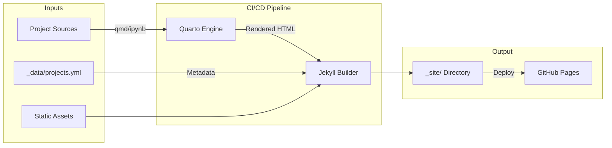

# BRT Serve Hub

Centralized dashboard hosting and aggregation platform for BRT research projects. This repository serves as the unified presentation layer, rendering data-driven dashboards from various sources into a cohesive static website.

## 🏗️ Architecture

The platform operates as a hybrid build system, combining **Quarto** for dynamic data rendering and **Jekyll** for static site orchestration.



## 📊 Hosted Projects

| Project | Repository | Dashboard Tool |
|:---|:---|:---|
| Maritime Engine | [Repo](https://github.com/brt-rj/Mari) | Quarto |
| Scope 2 Hub | [Repo](https://github.com/brt-rj/Scope2Emission) | Quarto |
| Construction Econ | [Repo](https://github.com/brt-rj/Con-Eco) | Quarto |
| Nature VCM | [Repo](https://github.com/brt-rj/NVCM) | Quarto |
| EcoStream | [Repo](https://github.com/brt-rj/GreenOps-Sidecar) | Looker |
| OpenSustain AI | [Repo](https://github.com/brt-rj/OpenSustain-AI-Engine) | Quarto |
| HypeCheck | [Repo](https://github.com/brt-rj/HypeCheck) | Streamlit |
| MS-RAP | [Repo](https://github.com/brt-rj/RAP-Scout) | Quarto |
| No Flab Brief | [Repo](https://github.com/brt-rj/no-flab-brief) | Quarto |
| SaaS Simulator | [Repo](https://github.com/brt-rj/Sub-Interceptor) | Looker |
| Governance | [Repo](https://github.com/brt-rj/Governance-Sidecar) | Streamlit |

## 📁 Repository Structure

```
brt-serve/
├── .github/workflows/   # CI/CD pipelines (Deploy, Validation)
├── _data/              
│   └── projects.yml     # Central registry of all projects
├── _layouts/            # Jekyll templates (default, project)
├── projects/            # Source directory for all dashboards
│   ├── mari/            # E.g., Maritime Engine source
│   ├── no-flab-brief/   # E.g., No Flab Brief source
│   └── ...
├── scripts/             # Automation utilities
│   ├── add-project.sh   # Script to scaffold new projects
│   └── validate-*.py    # QA scripts
└── dependencies...
```

## 🚀 Quick Start

### Prerequisites
- Ruby (3.1+) & Bundler
- Python (3.9+)
- Quarto CLI

### Local Development

1.  **Install Dependencies**
    ```bash
    # install jekyll gems
    bundle install
    
    # install python deps for quarto rendering
    pip install jupyter matplotlib pandas plotly great_tables duckdb
    ```

2.  **Add a New Project**
    Use the scaffold script to generate the directory structure:
    ```bash
    ./scripts/add-project.sh <slug> "Project Name"
    # Example: ./scripts/add-project.sh my-dash "My Dashboard"
    ```

3.  **Render Dashboards (Optional)**
    If working on a specific Quarto dashboard:
    ```bash
    quarto render projects/your-project --to html
    ```

4.  **Serve Site**
    ```bash
    bundle exec jekyll serve
    ```
    Access at: `http://localhost:4000/brt-view/`

## 🤝 Contributing

1.  **Register**: Add your project metadata to `_data/projects.yml`.
2.  **Scaffold**: Run `add-project.sh` to create your workspace.
3.  **Develop**: Place your `index.qmd` or dashboard content in `projects/<slug>/`.
4.  **Validate**: Ensure workflows pass before merging.

For detailed guidelines, see [CONTRIBUTING.md](CONTRIBUTING.md).

## 📝 License
Maintained by BRT Research.
