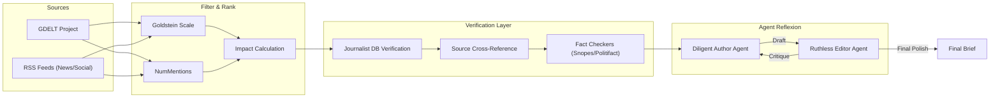

# **No-Flab Brief**

NFB is a multi-agent AI journalism system designed to verify, curate, and summarize news from reliable sources. This system uses a "Diligent Author" and "Ruthless Editor" architecture to ensure factual accuracy and eliminate "flab" (sensationalism/bias).

## System Architecture

## Core Strategy

### 1. Multi-Agent Reflexion (MAR)

We employ a two-agent system to escape "mental-set failures" and ensure objectivity:

#### Agent 1: Diligent Author (The Reporter)

* **Role**: Generates news drafts based on aggregated information from all verified sources.
* **Rule**: **NO Causal Inference**. The agent must report facts ($A$ happened, then $B$ happened) and strictly avoid implying $A$ *caused* $B$ unless explicitly cited from a direct source.
* **Output**: A dry, fact-heavy draft synthesizing the "What, Where, When, Who".

#### Agent 2: Ruthless Editor (The Critic)

* **Role**: Reviews the draft to strip away bias, opinion, and "flab".
* **The Checklist**: The agent *only* approves the draft after verifying:
  1. [ ] **Adjective Purge**: Are all subjective/judgmental adjectives removed? (e.g., "devastating", "skyrocketed", "fears", "hopes").
  2. [ ] **Neutral Verbs**: Are attribution verbs neutral? (Use "said" instead of "claimed", "insisted", "admitted").
  3. [ ] **No Causal Inference**: Is the distinction between correlation and causation strictly maintained?
  4. [ ] **Citation Check**: Is every claim explicitly backed by a source?
  5. [ ] **Tone Check**: Is the tone strictly third-person and devoid of emotional language?

### 2. Ranking Logic (GDELT)

To prioritize what matters, we use a weighted impact formula:

* **Goldstein Scale**: Measures the theoretical impact of an event on a country's stability (-10 for conflict, +10 for cooperation).
* **NumMentions**: Acts as a weight for significance; highly covered stories are more likely to influence global trends.
* **Ranking Priority**:

  1. **Impact**: Calculated via `Population Size (Region/Beat) * Goldstein Scale`.
  2. **Significance**: Validated by `NumMentions`.
  3. **Volume Control**: Strict limit of **100 Articles/Day**.

  * **Politics (40)**: 10 per region (NAM, EMEA, APAC, LATAM).
  * **Beats (60)**: 10 per beat (Business, Tech, Science, Social, Entertainment, Sports).

### 3. Verification Workflow

We move beyond simple filtering to active verification:

* **Source Diversity**: Aggregates reporting logic from RSS feeds (News sites, Social Media) and GDELT.
* **Cross-Reference**: Verifies if an event is being reported by multiple independent resources.
* **Human-in-the-Loop Validation**: Uses a **Journalist Database** (diverse group across regions and beats) to validate the credibility of the reporting.
* **Fact-Checking Integration**: Cross-references claims against trusted APIs like Snopes and PolitiFact.

## Source Intelligence

> **[View Detailed Source Documentation](Research/Source.md)**

For a comprehensive analysis of available data streams, including:

* **Unlimited & Free Data Sources** (GDELT, RSS, Official APIs)
* **Fact-Checking Resources** (Snopes, PolitiFact)
* **RSS Feed Library** (Categorized feeds for World, Tech, Finance)
* **Usage Rights & Compliance Guide**

## Verification Intelligence

> **[View Verification Strategy](Research/Verifiers.md)** | **[View Journalist Database](Research/Journalist-Database.csv)**

A curated signal layer to cross-reference against high-volume automated streams.

* **Human Signal Database**: A structured CSV of **320+ Journalists** balanced by Region (NAM, EMEA, APAC, LATAM) and Beat.
  * **Politics**: Spectrum-balanced (Center/Left/Right/Ind).
  * **Industry**: Role-balanced (Freelance Influencers vs. Agency Reporters).

## 🔒 Data Retention, Privacy & Compliance

### Data Retention Policy

* **Local Storage**: Articles are stored in local Excel files (`rss_feed_output.xlsx` and `news_api_output.xlsx`).
* **Retention Period**: Data is retained for processing and aggregation purposes.
* **No Long-Term Archival**: Beyond local storage, no articles are permanently archived.
* **Purpose**: Data is collected solely for news aggregation and analysis.

### Robots.txt Compliance

* **RSS Feeds**: All RSS feeds are publicly accessible resources provided by publishers for syndication.
* **Respect for robots.txt**: The system respects robots.txt directives from news sources.
* **API Usage**: GDELT and NewsData.io provide data through official APIs with proper terms of service.
* **Social Media**: Journalist handles on social media are publicly available information.

### Privacy Policy

* **No Personal Data Collection**: The system does not collect any personal information from users.
* **Publicly Available Content**: All aggregated content is from publicly accessible news sources.
* **Journalist Database**: Uses only publicly available social media handles from verified journalists.
* **No Tracking**: No user tracking or analytics beyond GitHub Pages defaults.
* **Data Usage**: Collected news data is used exclusively for aggregation and analysis purposes.
* **Third-Party Services**:

- GDELT and NewsData.io with their respective privacy policies
